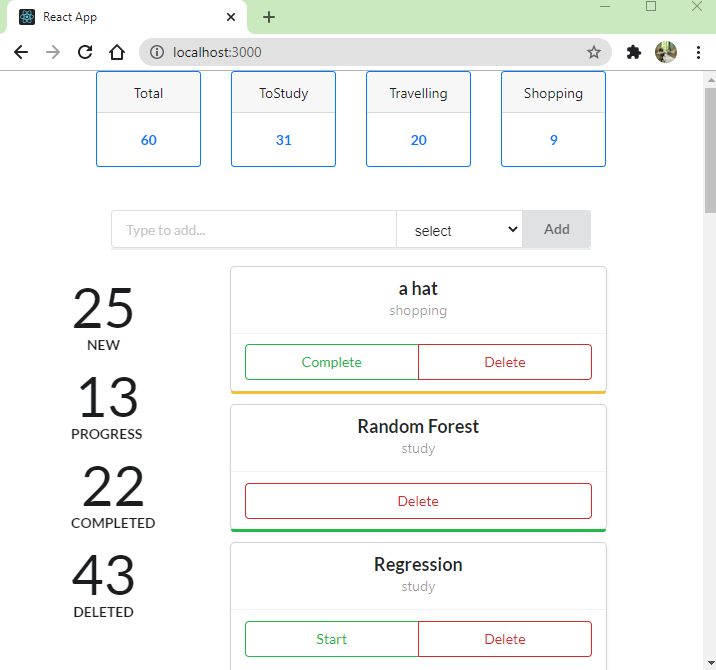

# A Realtime TODO App

## Techs

- React
- Redux
- Socket-io
- Flask
- Database - MongoDB

### Functionality

- It is a real time app. Thus open in multiple windows so that you can realize the behaviour easily
- Whenever you add a item, a todo item will be added as 'New Item' and numbers will be updated as well based on the type (Study/Travelling/Shopping)
- Then for any item , you will have 2 buttons - delete and start/complete. If you click on any one of them, both corresponding item's status and Count Statistics will be updated..
- As it is a realtime app, the update will be visible on all windows..

### Demo Video

[link](https://github.com/teddcp2/TODOS_with_REACT_FLASK_REDUX_SOCKET_IO/blob/master/FLASK_REACT_REDUX_SOCKET-io.mp4)

<iframe width="560" height="315"
src="https://www.youtube.com/embed/MUQfKFzIOeU" 
frameborder="0" 
allow="accelerometer; autoplay; encrypted-media; gyroscope; picture-in-picture" 
allowfullscreen></iframe>

### Some Pictures

### Some Useful Links

- [Redux socketio middleware](https://gist.github.com/markerikson/3df1cf5abbac57820a20059287b4be58)
- [Redux socketio middleware 2](https://stackoverflow.com/questions/51831824/where-to-store-class-instance-for-reusability-in-redux)
- [Redux socketio middleware 3](https://dev.to/aduranil/how-to-use-websockets-with-redux-a-step-by-step-guide-to-writing-understanding-connecting-socket-middleware-to-your-project-km3)
- [WebSocket with React and Redux](https://www.pluralsight.com/guides/using-web-sockets-in-your-reactredux-app)
- [Beautiful example of React + redux + socket-io + node.js](https://medium.com/@gethylgeorge/using-socket-io-in-react-redux-app-to-handle-real-time-data-c0e734297795)
- [react-redux-universal-hot-example](https://github.com/erikras/react-redux-universal-hot-example/blob/master/src/redux/middleware/clientMiddleware.js)
- [StackOverflow question on socket-io middleware](https://stackoverflow.com/q/37876889/12210002)
- [Chat App](https://www.freecodecamp.org/news/build-a-chat-app-with-react-typescript-and-socket-io-d7e1192d288/)
- [Flask-socketIO + js](https://medium.com/@abhishekchaudhary_28536/building-apps-using-flask-socketio-and-javascript-socket-io-part-1-ae448768643)
- [Blog of Miguel about Flask socketio](https://blog.miguelgrinberg.com/post/easy-websockets-with-flask-and-gevent)
- [flask chat app](https://codeburst.io/building-your-first-chat-application-using-flask-in-7-minutes-f98de4adfa5d)
- [Good example of react + socket-io](https://www.freecodecamp.org/news/how-to-create-a-realtime-app-using-socket-io-react-node-mongodb-a10c4a1ab676/)
- [React+ socket-io](https://www.valentinog.com/blog/socket-react/) \*[Chat app](https://dev.to/captainpandaz/a-socket-io-tutorial-that-isn-t-a-chat-app-with-react-js-58jh)

#### Thanks for reading...

- Debasis
